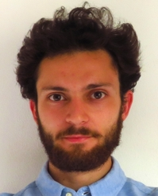
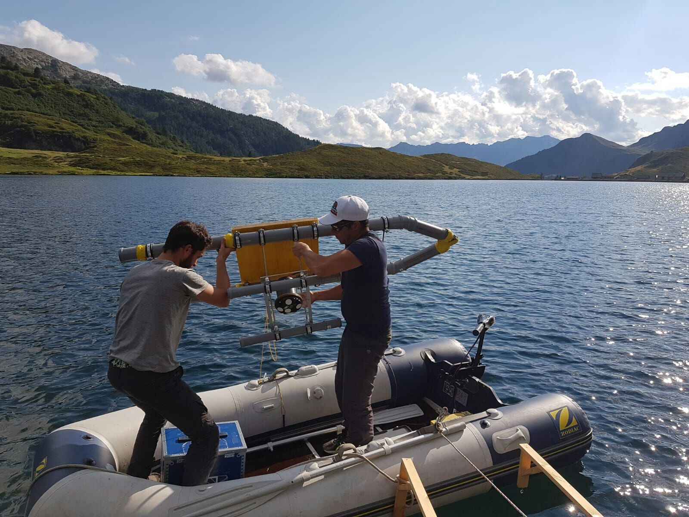
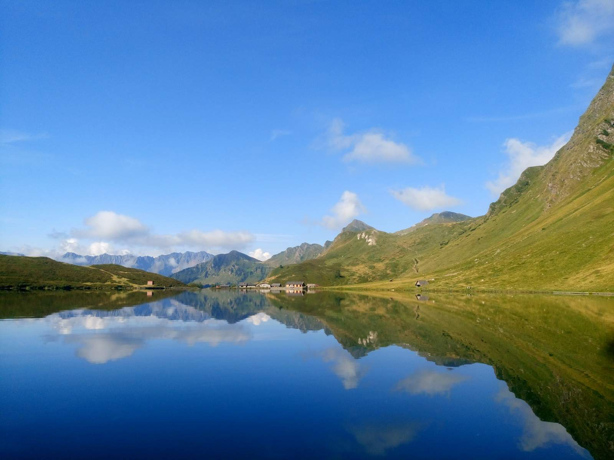

### Angelo Carlino

Postdoctoral researcher @ <a href="www.ei.deib.polimi.it"> Environmental Intelligence Lab</a>, Politecnico di Milano  
Visiting postdoctoral scholar @ Natural Capital Project, Stanford University

email: [angelo.carlino@polimi.it](mailto:angelo.carlino@polimi.it)

<a href="https://scholar.google.com/citations?user=-8pdFX0AAAAJ&hl=en"> Google Scholar </a>  -
<a href="www.twitter.com/AngeloCarlino3"> Twitter </a> -
<a href="https://www.linkedin.com/in/angelo-carlino-570051170/"> LinkedIn </a> -
<a href="https://orcid.org/0000-0002-8403-9070"> ORCID </a>

 

# Education

PhD in Information Technology @ Politecnico di Milano (2022)  
BS in Environmental Engineering @ Politecnico di Milano (2015)  
MS in Environmental Engineering @ Politecnico di Milano (2018)
  
# Research

### Multi-objective adaptive decision-making for climate policy
I am interested in improving decision-making support systems in this context using:
- stochastic models
- multi-objective optimization
- evolutionary algorithms
- optimal control
- decision-making under deep uncertainty methods

### Low-carbon energy systems
- Life-cycle GHG emissions impact on power system planning
- Integrated modelling of regional energy and water systems for:
  + joint optimization of planning and operations
  + impact and vulnerability assessment of electricity systems under climate change
- Strategic dam planning, also using robust optimization

### Other research interests:
- Water resources systems modelling and simulation
- Limnology

### Other experience
I worked for two summers as an intern/researcher at EPFL & Eawag studying the bacterial layer in lake Cadagno, Switzerland.   
The field campaigns resulted in <a href="https://zenodo.org/badge/DOI/10.5281/zenodo.7127882.svg"> a publicly available dataset </a> which has been used in a number of studies.

  

 

