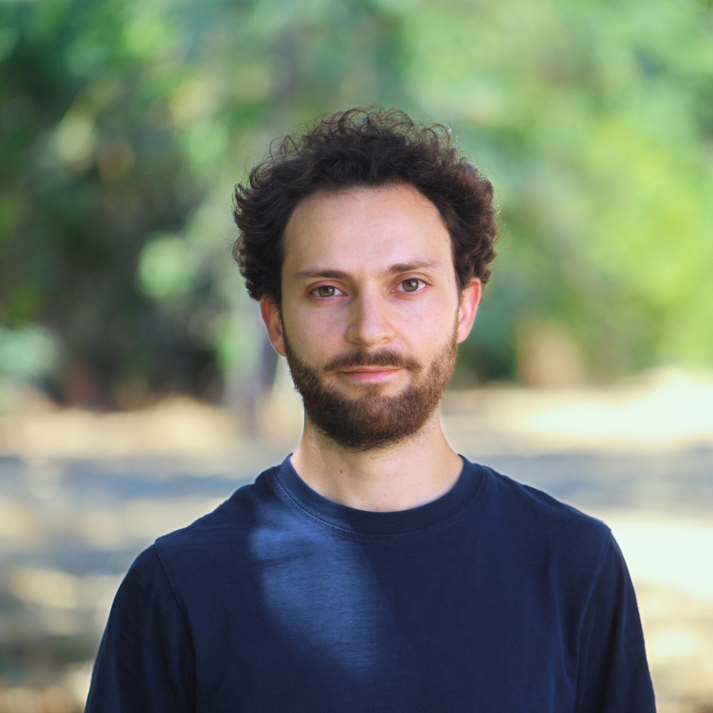

 
Postdoctoral Fellow 
 
Carnegie Institution for Science
 
Stanford, CA, USA  
 
email: [acarlino@carnegiescience.edu](mailto:acarlino@carnegiescience.edu)  
 
<a href="https://scholar.google.com/citations?user=-8pdFX0AAAAJ&hl=en"> Google Scholar </a>  -
<a href="www.twitter.com/AngeloCarlino3"> Twitter </a> -
<a href="https://www.linkedin.com/in/angelo-carlino-570051170/"> LinkedIn </a> -
<a href="https://orcid.org/0000-0002-8403-9070"> ORCID </a>

 

 

I am a postdoctoral fellow in the <a href="https://climateenergylab.org/">Climate Energy Lab</a> at the Carnegie Institution for Science at Stanford, USA. I am currently working on decision-making under uncertainty for technological innovation and energy system modeling.
 

In my research, I am interested in developing and applying methods to address complex sustainability challenges, in particular, to support infrastructural planning for the energy and water sectors and climate policy design. See more at <a href="angelo-carlino.github.io/Research.html"> Research Interest</a>.
 

I earned my BSc and MSc in Environmental Engineering from Politecnico di Milano where I also obtained my PhD in Information Technology in 2022 in the <a href="https://www.ei.deib.polimi.it/"> Environmental Intelligence Lab</a>. 
After that, I was a visiting postdoctoral scholar at the <a href="https://naturalcapitalproject.stanford.edu/"> Natural Capital Project</a> at Stanford University. See more at <a href="angelo-carlino.github.io/Education.html"> Education</a>.
