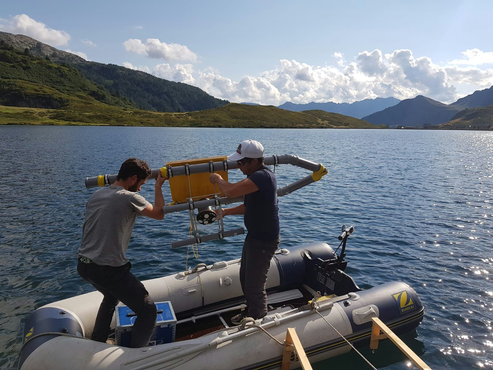
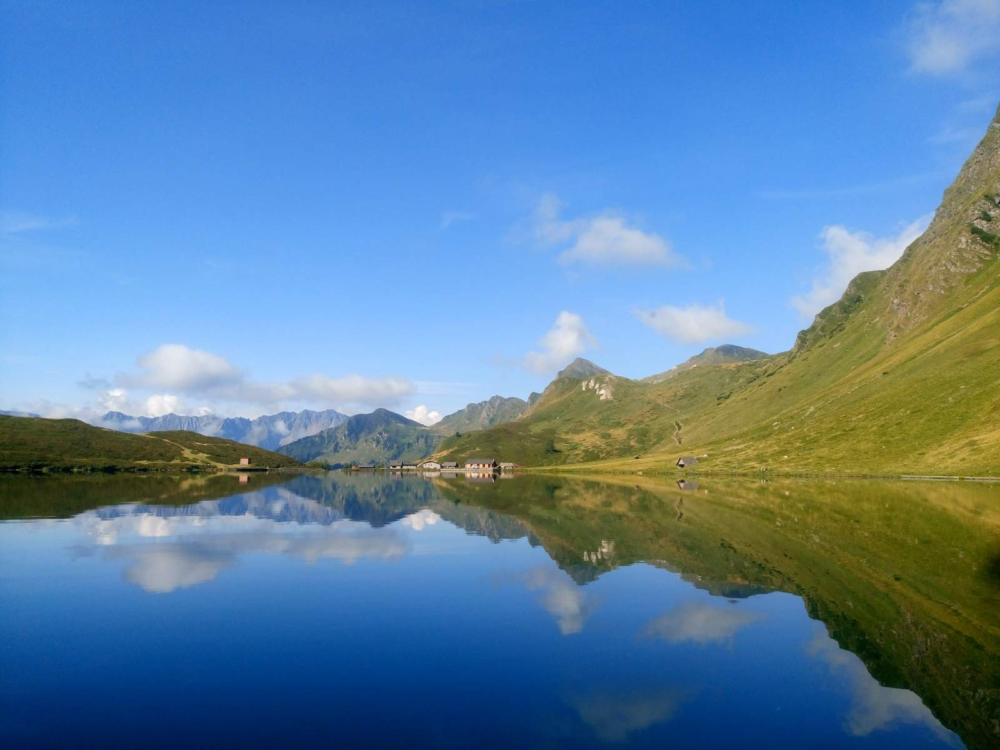

## Other experience

I worked for two summers as an intern/researcher at EPFL & Eawag studying the bacterial layer in Lake Cadagno, Switzerland.   
The field campaigns resulted in <a href="https://zenodo.org/badge/DOI/10.5281/zenodo.7127882.svg"> a publicly available dataset </a> which has been used in a number of studies.

  

 

